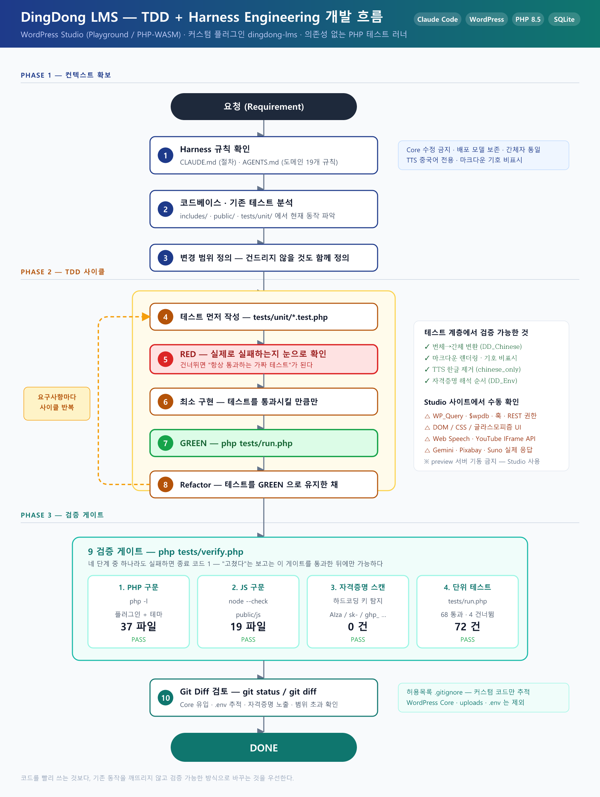

# DingDong LMS

> 한국인 학습자를 위한 **AI 기반 중국어·중국문화 교육 플랫폼** (WordPress 플러그인)

Google Gemini API로 중국어 강좌·강의·삽화·퀴즈를 자동 생성하고, YouTube 실영상과
결합해 학습 콘텐츠를 구성하는 워드프레스 플러그인입니다. 학습자 화면은 오디오북(TTS),
인터랙티브 스토리, 단어장, 게이미피케이션, AI 학습도우미까지 포함합니다.

---

## 목차

- [주요 기능](#주요-기능)
- [기술 스택](#기술-스택)
- [설치 및 실행](#설치-및-실행)
- [환경변수 설정](#환경변수-설정)
- [테스트 실행](#테스트-실행)
- [개발 방법론](#개발-방법론)
- [프로젝트 구조](#프로젝트-구조)
- [주의사항](#주의사항)

---

## 주요 기능

### 관리자 — AI 콘텐츠 생성

| 기능 | 설명 |
|---|---|
| **AI 강좌 생성** | 주제·난이도를 입력하면 Gemini가 강좌 개요와 주차별 강의를 생성 |
| **강의 본문 생성** | 핵심표현·본문·슬라이드·퀴즈·실전대화·문화노트를 구조화 JSON으로 생성 |
| **이미지 생성** | 배너·4컷 학습만화·스토리북 삽화를 Gemini 이미지 모델로 생성 (4단계 fallback) |
| **YouTube 연동** | 한국어/중국어 키워드로 최근 3개월 영상을 검색해 자동 임베드 |
| **중국어 노래 학습** | 실제 MV + 자막 추출 → 가사 타임스탬프 싱크 강좌 생성 |
| **인터랙티브 스토리** | 분기형 스토리 생성 (선택지·엔딩 수집·스토리 맵) |
| **뉴스레터** | 중국 문화 뉴스레터 자동 생성 및 공개 링크 발행 |

### 학습자 — 학습 화면

- **오디오북 TTS** — 중국어(`zh-CN`) 전용 음성 재생, 화자별 음성 프로필
- **5탭 강의 뷰어** — 학습내용 9개 섹션, 슬라이드, 퀴즈(3유형 6문제), 작문 연습
- **叮叮 학습도우미** — 음성인식 입력 + 중국어 TTS 응답, AI 채팅, 코치마크
- **게이미피케이션** — XP·10단계 레벨·스트릭·업적 14종·콤보·XP 상점·데일리/레전드 챌린지
- **AI 단어장** — 플래시카드, 미니게임 4종, 에빙하우스 복습 스케줄
- **번체→간체 자동 통일** — 외부에서 들어온 번체자 콘텐츠를 결정적 변환기로 간체화

---

## 기술 스택

| 영역 | 사용 기술 |
|---|---|
| 백엔드 | PHP 8.x, WordPress Plugin API (훅·REST API·CPT·Options API) |
| 프론트엔드 | **Vanilla JavaScript** (프레임워크 없음), `wp.apiFetch`, CSS 글라스모피즘 |
| 데이터 | WordPress CPT 4종 (`dd_course` / `dd_lesson` / `dd_story` / `dd_newsletter`) + post meta |
| 외부 API | Google Gemini, YouTube Data API v3, Pixabay |
| 브라우저 API | Web Speech API (인식/합성), YouTube IFrame Player API |
| 테스트 | 의존성 없는 자체 PHP 테스트 러너 (`tests/`) |
| 로컬 환경 | WordPress Studio (Playground / PHP-WASM + SQLite) |

> ⚠️ **빌드 단계가 없습니다.** `package.json`·`composer.json`·`node_modules`·`vendor`가
> 존재하지 않습니다. npm install / composer install 이 **필요 없으며**, 소스 파일이
> 곧 실행 파일입니다. 배포는 플러그인 폴더를 zip 으로 압축하는 것이 전부입니다.

---

## 설치 및 실행

### 방법 A — WordPress Studio (이 저장소의 개발 환경)

이 저장소의 루트는 WordPress 설치 전체 구조를 따르지만, **Git 으로 추적되는 것은
직접 작성한 코드뿐**입니다. WordPress Core 는 포함돼 있지 않으므로 Studio 가 내려받습니다.

1. [WordPress Studio](https://developer.wordpress.com/studio/) 를 설치합니다.
2. Studio 에서 새 사이트를 만들고, 사이트 폴더에 이 저장소를 clone 합니다.
3. Studio 앱에서 사이트를 시작합니다.
4. 관리자 화면 → 플러그인 → **Dingdong LMS** 활성화.
5. 좌측 메뉴에 **Dingdong LMS** 가 나타나면 정상입니다.

```bash
studio status                 # URL · 관리자 계정 · PHP/WP 버전 확인
studio start --skip-browser   # 사이트 시작
```

> Studio 는 Playground(PHP-WASM)에서 동작하므로 `wp` 명령은 반드시 `studio wp` 로 실행합니다.

### 방법 B — 일반 WordPress 사이트에 플러그인만 설치

```bash
cd wp-content/plugins
zip -r dingdong-lms.zip dingdong-lms/
```

생성된 zip 을 워드프레스 관리자 → 플러그인 → 새로 추가 → 플러그인 업로드로 설치합니다.
활성화하면 랜딩페이지와 내비게이션 메뉴가 자동 생성됩니다.

---

## 환경변수 설정

API 키는 **세 단계 우선순위**로 해석됩니다.

```
PHP 상수 (wp-config.php)  →  환경변수 (.env)  →  wp_options (관리자 화면 등록)
```

### 정상 경로 — 관리자 화면 등록

플러그인을 설치한 사이트의 관리자가 **Dingdong LMS → 설정** 에서 본인 키를 직접 등록합니다.
키는 `AUTH_KEY` 기반 AES-256-CBC 로 암호화되어 DB 에 저장됩니다.
**별도 설정 없이 이 경로만으로 동작합니다.**

### 개발용 오버라이드 — `.env`

로컬 개발 시에는 `.env` 로 키를 주입할 수 있습니다.

```bash
cp .env.example .env
```

```env
DD_GEMINI_API_KEY=your_gemini_api_key_here
DD_YOUTUBE_API_KEY=your_youtube_api_key_here
DD_PIXABAY_API_KEY=your_pixabay_api_key_here
```

| 변수 | 용도 | 발급처 |
|---|---|---|
| `DD_GEMINI_API_KEY` | 강좌·이미지·스토리·뉴스레터 생성 | https://aistudio.google.com/apikey |
| `DD_YOUTUBE_API_KEY` | 관련 영상 검색/임베드 | Google Cloud Console → YouTube Data API v3 |
| `DD_PIXABAY_API_KEY` | 강좌 썸네일 | https://pixabay.com/api/docs/ |

> ⚠️ **`.env` 는 `.gitignore` 로 제외되며 절대 커밋하지 않습니다.**
> `.env.example` 에는 실제 값을 넣지 않습니다.

> ⚠️ Playground(PHP-WASM)에서는 `getenv()` 가 제한될 수 있습니다.
> `.env` 가 동작하지 않으면 `wp-config.php` 에 직접 정의하세요:
> ```php
> define( 'DD_GEMINI_API_KEY', '...' );
> ```

### 학습자 키 (프론트엔드)

叮叮 채팅·AI 튜터·발음 코치·한자 획순·단어장 AI 는 학습자 **본인의 Gemini 키**를
`localStorage` 에 저장해 사용합니다. 요금을 학습자에게 분산하기 위한 의도된 설계이며,
키는 `x-goog-api-key` **헤더**로만 전송됩니다 (쿼리스트링 사용 금지).
키가 없으면 해당 기능만 조용히 비활성화되고 나머지 학습 기능은 정상 동작합니다.

---

## 테스트 실행

외부 의존성 없이 **PHP 하나만 있으면** 실행됩니다.

```bash
php tests/verify.php
```

이 한 줄이 4단계를 모두 실행합니다.

| 단계 | 내용 |
|---|---|
| 1 | PHP 구문 검사 — 플러그인·테마 전체 `php -l` |
| 2 | JS 구문 검사 — `node --check` |
| 3 | 하드코딩 자격증명 스캔 — API 키가 코드에 섞여 들어갔는지 |
| 4 | 단위 테스트 — `tests/run.php` |

개별 실행:

```bash
php tests/run.php
```

특정 테스트 파일만:

```bash
php tests/run.php dd-chinese
```

### 현재 테스트 현황

```
1/4  PHP 구문 검사       34개 파일 / 실패 0
2/4  JS 구문 검사        18개 파일 / 실패 0
3/4  하드코딩 자격증명 스캔  52개 파일 / 0건
4/4  단위 테스트         73건 / 통과 71 / 실패 0 / 건너뜀 2

결과: PASS
```

건너뛴 2건은 `openssl` 확장이 없는 PHP CLI 빌드에서 검증이 불가능한 암·복호화 테스트입니다.
**통과로 위장하지 않고** `require_that()` 로 명시적으로 건너뜁니다.

### 테스트 범위와 한계

| 계층 | 자동화 | 비고 |
|---|---|---|
| 순수 로직 (번체→간체, 마크다운 렌더링, 자격증명 해석, 생성 단계 분리) | ✅ 자동 | `tests/unit/` |
| WordPress 런타임 (`WP_Query`, 훅, REST 등록, 권한) | ❌ | Studio 사이트에서 수동 확인 |
| DOM·CSS·TTS·게이미피케이션 | ❌ | 브라우저 필요 |
| 외부 API 실응답 (Gemini / YouTube / Pixabay) | ❌ | 네트워크·요금 발생 |

전 계층 자동화 대신 **순수 로직만 자동 검증하고 나머지는 수동 확인**하는 전략을 택했습니다.
WordPress 런타임을 스텁으로 재현하면 "스텁이 스텁을 검증하는" 무가치한 테스트만 늘어나기 때문입니다.

---

## 개발 방법론

이 프로젝트는 **Harness 개발 사이클 + TDD** 를 명시적 규칙으로 강제합니다.
AI 코딩 에이전트(Claude Code)와 협업하면서 "요청 → 바로 수정" 으로 인한
범위 초과·회귀를 막기 위한 장치입니다.



```
요청 → ① 규칙 확인 → ② 코드·기존 테스트 분석 → ③ 변경 범위 정의
     → ④ 테스트 먼저 작성 → ⑤ RED 확인 → ⑥ 최소 구현 → ⑦ GREEN 확인
     → ⑧ Refactor → ⑨ php tests/verify.php → ⑩ git status/diff 검토 → 완료
```

핵심 원칙 두 가지:

- **⑤ RED 를 건너뛰지 않는다.** 실패를 눈으로 확인하지 않은 테스트는
  "항상 통과하는 가짜 테스트" 일 수 있습니다.
- **③ 변경 범위를 먼저 정의한다.** 건드리지 않을 것도 함께 정의해서,
  요청하지 않은 대규모 리팩터링을 원천 차단합니다.

규칙 문서:

| 파일 | 역할 |
|---|---|
| [`CLAUDE.md`](CLAUDE.md) | 최상위 개발 규칙 — 개발 사이클, 검증 명령, 테스트 작성법, 자격증명 관리, 승인 필요 작업 |
| [`AGENTS.md`](AGENTS.md) | 도메인 규칙 22개 — 중국어 표기, TTS, 이미지 생성, 요금 관리, 생성 단계 분리 등 |
| [`STUDIO.md`](STUDIO.md) | WordPress Studio(Playground/SQLite) 환경 제약과 CLI 사용법 |

`AGENTS.md` 의 필수 규칙은 **규칙 하나당 테스트 하나**로 고정하는 것을 목표로 합니다.
예를 들어 규칙 20(생성 요청 분할)은 `tests/unit/dd-lesson-phases.test.php` 가 회귀를 막습니다.

---

## 프로젝트 구조

```
.
├── README.md                      이 파일
├── CLAUDE.md / AGENTS.md / STUDIO.md   개발 규칙 문서
├── .env.example                   환경변수 예시 (실제 값 없음)
├── paper_images/                  개발 흐름도 (SVG 원본 + PNG)
├── design/                        디자인 시안 3종
├── tests/
│   ├── verify.php                 4단계 통합 검증 게이트
│   ├── run.php                    테스트 러너
│   ├── framework.php              의존성 없는 테스트 프레임워크
│   ├── wp-stubs.php               필요한 WordPress 함수만 스텁
│   └── unit/                      단위 테스트 5종
└── wp-content/
    ├── plugins/dingdong-lms/      ★ 메인 플러그인
    │   ├── dingdong-lms.php       플러그인 진입점 (헤더·상수·훅 등록)
    │   ├── uninstall.php          삭제 시 옵션·메타 정리
    │   ├── includes/              PHP 클래스 18개 (아래 표 참조)
    │   ├── admin/                 관리자 화면 (views 6 · JS · CSS)
    │   ├── public/                학습자 화면 (templates 8 · JS 16 · CSS 9)
    │   └── tools/                 YouTube 자막 추출 북마클릿
    └── themes/dingdong/           커스텀 블록 테마 (theme.json 기반)
```

### 주요 클래스

| 파일 | 역할 |
|---|---|
| `class-dd-loader.php` | 훅 등록, 관리자 메뉴, 에셋 enqueue |
| `class-dd-rest-api.php` | REST 엔드포인트 38개 (관리자 인증 + 토큰 기반 공개 API) |
| `class-dd-course-generator.php` | 강좌·강의 Gemini 프롬프트, 생성 단계 분리 |
| `class-dd-image-generator.php` | 이미지 생성 4단계 fallback, 하이브리드 만화 패널 |
| `class-dd-public-access.php` | 마크다운 렌더러, 구조화 대화, 공개 링크 라우팅 |
| `class-dd-youtube-subtitles.php` | 자막 추출 엔진 (Innertube 7단계, 429 백오프, 7일 캐싱) |
| `class-dd-chinese.php` | 번체→간체 결정적 변환기 (mbstring 비의존) |
| `class-dd-env.php` | 자격증명 해석기 (상수 → 환경변수 → DB) |
| `class-dd-api-key.php` | API 키 AES-256-CBC 암·복호화 저장 |
| `class-dd-gemini.php` | Gemini 통신 래퍼 + 요청 throttle (429 완화) |

---

## 주의사항

### 저장소 범위

이 저장소는 **직접 작성한 코드만** 추적합니다. `.gitignore` 는 "전부 무시 후 필요한
것만 되살리는" 허용목록(allowlist) 방식입니다.

**추적하지 않는 것**: WordPress Core (`wp-admin/`, `wp-includes/`, 루트 `wp-*.php`),
`wp-config.php`, 서드파티 플러그인/테마, `wp-content/uploads/`, SQLite DB,
`.env`, 학위논문 원고 및 내부 작업 문서.

### WordPress Core 를 수정하지 않습니다

WordPress 동작을 바꿔야 하면 훅(action/filter)·플러그인·자식 테마·REST API 중 하나를 씁니다.
Studio 는 Playground(PHP-WASM)에서 동작하므로 Core 를 고쳐도 **서버 재시작 시 사라집니다.**

### API 요금 — 이미지가 비용의 대부분

| 생성물 | 이미지 | 텍스트 호출 |
|---|---|---|
| 강의 1개 | 최대 12장 | 1회 |
| 5주차 강좌 | 최대 60장 | 6회 |
| 스토리 1개 | 최대 8장 | 1회 |

관리자 화면에서 생성 전에 이미지 종류별로 **끌 수 있으며**, 예상 장수가 실시간으로 표시됩니다.
스토리북 삽화(6장)는 가장 비싸므로 기본 해제 상태입니다.
이미 생성한 콘텐츠를 다시 보는 것은 무료입니다.

### 강의 생성은 요청을 나눠 보냅니다

강의 하나를 한 HTTP 요청에서 다 만들면 공유호스팅의 프록시 타임아웃이 연결을 끊습니다.
그래서 `강좌 개요 → 본문 생성 → 에셋 단계별 생성` 으로 분리돼 있고,
응답 유실 시 `client_ref` 멱등키로 실제 생성 여부를 확인합니다.

### 로컬 개발 사이트 기준입니다

`wp-config.php` 의 인증 솔트가 기본 플레이스홀더 상태입니다.
DB 에 저장되는 API 키의 암호화가 사실상 난독화 수준이므로, **이 사이트를 외부에
공개하거나 실제 운영 키를 넣기 전에는 반드시 솔트를 재생성해야 합니다.**
(솔트를 바꾸면 로그인 세션이 만료되고 기존 저장 키는 복호화 불가가 되어 재입력이 필요합니다.)

---

## 라이선스

**GPL-2.0-or-later** — WordPress 및 그 플러그인 생태계의 표준 라이선스를 따릅니다.
전문은 [`LICENSE`](LICENSE) 파일을 참고하세요.

```
Copyright (C) 2026 leeyuna

이 프로그램은 자유 소프트웨어입니다. 자유 소프트웨어 재단이 공표한 GNU 일반 공중 사용
허가서 버전 2 또는 (선택에 따라) 그 이후 버전의 조건에 따라 재배포하거나 수정할 수 있습니다.

이 프로그램은 유용하게 쓰이기를 바라며 배포되지만, 상품성이나 특정 목적 적합성에 대한
묵시적 보증을 포함한 어떠한 보증도 제공하지 않습니다. 자세한 내용은 GNU 일반 공중
사용 허가서를 참고하세요.
```

이 저장소는 학위논문 연구 산출물로 공개되었습니다. 코드를 참고하거나 활용하실 때
출처를 밝혀 주시면 감사하겠습니다.
